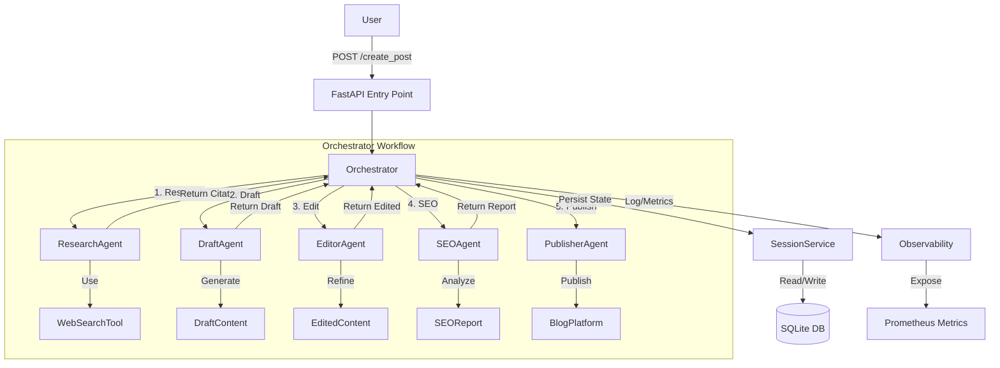

# Automated Blog Concierge

A multi-agent system that autonomously researches, drafts, edits, optimizes, and publishes blog posts. Built with FastAPI, Python, and Google Gemini (or Demo Mode).

## 🚀 Features

*   **Multi-Agent Architecture**:
    *   **Research Agent**: Gathers information using DuckDuckGo Search.
    *   **Draft Agent**: Generates initial content based on research.
    *   **Editor Agent**: Refines content for clarity and tone.
    *   **SEO Agent**: Analyzes content for search engine optimization.
    *   **Publisher Agent**: Simulates or performs publishing.
*   **Orchestration**: Manages the workflow state, checkpoints, and error handling.
*   **Observability**: Prometheus metrics exposed on port 8001.
*   **Persistence**: SQLite database for session and state management.
*   **Frontend**: Simple HTML interface for triggering workflows.

## 🛠️ Setup & Installation

### Architecture Diagram



### Prerequisites

*   Python 3.11+
*   Docker (optional)

### Local Setup

1.  **Clone the repository:**
    ```bash
    git clone https://github.com/GitZaidHub/blog-automation-agent.git
    cd Concierge
    ```

2.  **Create a virtual environment:**
    ```bash
    python -m venv .venv
    # Windows
    .\.venv\Scripts\activate
    # Linux/Mac
    source .venv/bin/activate
    ```

3.  **Install dependencies:**
    ```bash
    pip install -r requirements.txt
    ```

4.  **Configure Environment:**
    Create a `.env` file in the root directory:
    ```env
    LLM_MODE=gemini  # or 'demo'
    GEMINI_API_KEY=your_api_key_here
    GEMINI_MODEL=gemini-1.5-flash
    LOG_LEVEL=INFO
    ```

5.  **Run the Application:**
    ```bash
    uvicorn src.main:app --reload --port 8000
    ```
    Access the UI at `http://localhost:8000`.

### Docker Setup

1.  **Build the image:**
    ```bash
    docker build -t concierge .
    ```

2.  **Run the container:**
    ```bash
    docker run -p 8000:8000 -p 8001:8001 --env-file .env concierge
    ```

## 📂 Project Structure

*   `src/agents`: Individual agent implementations (Research, Draft, Editor, SEO, Publisher).
*   `src/tools`: Utility tools (Web Search, SEO Analysis).
*   `src/sessions`: Session management and memory.
*   `src/orchestrator.py`: Main workflow logic.
*   `src/llm_client.py`: Interface for LLM interactions (Gemini/Demo).
*   `src/main.py`: FastAPI entry point.

## 🧪 Testing

Run the test suite using pytest:

```bash
python -m pytest
```

## 📊 Monitoring

Prometheus metrics are available at `http://localhost:8001`.
