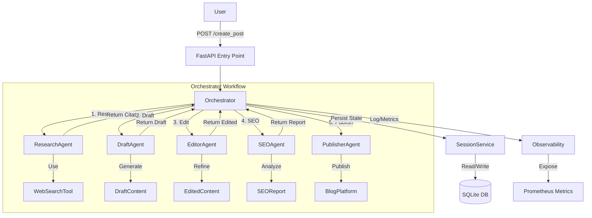

# System Architecture

The **Automated Blog Concierge** is a multi-agent system designed to autonomously research, draft, edit, optimize, and publish blog posts. It leverages a micro-agent architecture orchestrated by a central workflow engine.

## System Overview

The system follows a linear workflow where a user request triggers a sequence of specialized agents. Each agent performs a specific task and passes the result to the next stage, with the state managed by a central Orchestrator.

### Architecture Diagram

## Core Components

### 1. Orchestrator (`src/orchestrator.py`)
The **Orchestrator** is the central brain of the application. It:
- Initializes the workflow for each user request.
- Instantiates agents with the current session context.
- Manages the flow of data between agents.
- Handles state persistence and checkpoints.
- Catches errors and manages workflow status (running, completed, failed).

### 2. Agents (`src/agents/`)
Each agent is a specialized worker responsible for a distinct part of the content creation pipeline:

- **Research Agent** (`research_agent.py`):
  - Analyzes the user's topic.
  - Generates search queries.
  - Uses the `WebSearchTool` to fetch relevant information from the web (via DuckDuckGo).
  - Summarizes findings into citations.

- **Draft Agent** (`draft_agent.py`):
  - Takes the user's topic and the research citations.
  - Generates a comprehensive blog post draft.
  - Follows a structured format (Introduction, Body, Conclusion).

- **Editor Agent** (`editor_agent.py`):
  - Reviews the draft for clarity, tone, and flow.
  - Fixes grammatical errors and improves readability.
  - Ensures the content aligns with the intended audience.

- **SEO Agent** (`seo_agent.py`):
  - Analyzes the edited content for SEO best practices.
  - Checks for keyword usage, readability scores, and meta descriptions.
  - Provides an SEO report.

- **Publisher Agent** (`publisher_agent.py`):
  - Handles the final step of the process.
  - Can simulate publishing or integrate with actual platforms (extensible).
  - Returns the final published URL or status.

### 3. Tools (`src/tools/`)
Tools provide external capabilities to the agents:
- **WebSearchTool**: Performs actual HTTP requests to search engines to retrieve real-time data.
- **SEOAnalyzer**: A utility to programmatically analyze text statistics (word count, keyword density).

### 4. Session Management (`src/sessions/`)
The system maintains state across long-running workflows using:
- **SessionService**: A wrapper around the database operations.
- **SQLite**: A local relational database used to store session payloads, agent outputs, and workflow status.
- **Memory**: An abstraction for handling conversation history and context logs within a session.

### 5. Observability (`src/observability/`)
To monitor the health and performance of the system:
- **Prometheus Metrics**: The system exposes metrics (e.g., `workflows_started_total`) on port `8001`.
- **Logging**: Structured logging is used to track events like workflow starts, completions, and errors.

### 6. LLM Client (`src/llm_client.py`)
The interface to the Large Language Model (Google Gemini). It handles:
- API authentication.
- Model configuration (temperature, top_p).
- Fallback to a "Demo Mode" for testing without an API key.
